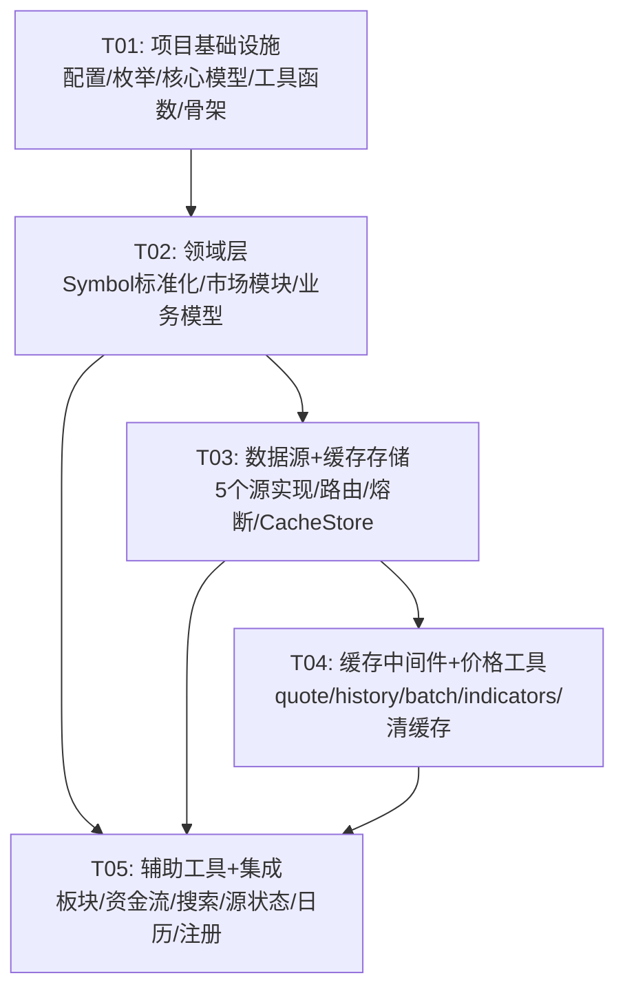

# market-data-mcp V0.1 系统设计文档

> 架构师：Bob | 日期：2026-06-18 | 版本：V0.1

---

## Part A: 系统设计

---

## 一、实现方案

### 1.1 核心技术挑战

| 挑战 | 说明 |
|------|------|
| 多市场 symbol 歧义 | 用户输入 "600519" 可能是 A 股，"AAPL" 是美股，需要自动检测 + 三层标准化 |
| 多数据源路由与 fallback | 每市场至少 2 个免费源，主源失败自动切换，源状态实时追踪 |
| 市场时段感知缓存 | 盘中（连续竞价及前后竞价时段）先清空全部缓存且不写缓存；非盘中正常读写 |
| 数据字段归一化 | 腾讯/新浪/东方财富/yfinance 返回字段各异，需统一为 V0.1 schema |
| 动态 TTL 与熔断 | 连续失败自动降级 + 冷静期恢复，避免雪崩 |

### 1.2 框架与库选型

| 组件 | 选型 | 理由 |
|------|------|------|
| MCP 框架 | **FastMCP** | 官方推荐，装饰器风格定义工具，零样板代码 |
| HTTP 客户端 | **httpx** (async) | 异步支持，连接池，超时控制，适合同时请求多个数据源 |
| 数据计算 | **pandas + numpy** | 技术指标本地计算（MA/EMA/RSI/MACD/BOLL/KDJ） |
| 美股/港股数据 | **yfinance** | 免费、覆盖 US/HK，稳定 |
| 数据校验 | **Pydantic v2** | FastMCP 内置依赖，模型校验 + 序列化 |
| 缓存后端 | **自建 OrderedDict**（FIFO） | 纯内存、默认 100 条容量，FIFO 滚动淘汰（满时删最老记录），零外部依赖 |
| 配置管理 | **pydantic-settings** | 环境变量 + 默认值，类型安全 |
| 交易日历 | **pandas_market_calendars** + **akshare** | 美股/港股用 `pandas_market_calendars`，A 股用 `akshare` 获取交易日历 |

### 1.3 架构模式

采用 **分层架构 (Layered Architecture)** ：

```
┌─────────────────────────────────────────────────────┐
│  Tools Layer (10 MCP Tools)                         │
│  quote / history / batch / indicators / sector /    │
│  capital_flow / search / source_status / calendar / │
│  clear_cache                                        │
├─────────────────────────────────────────────────────┤
│  Cache Layer (Middleware Pattern)                   │
│  CachePolicy → CacheStore → CacheMiddleware         │
├─────────────────────────────────────────────────────┤
│  Source Layer (Strategy Pattern)                    │
│  BaseSource → YFinance / Tencent / Sina / EastMoney │
│  SourceRouter → CircuitBreaker                      │
├─────────────────────────────────────────────────────┤
│  Domain Layer                                       │
│  SymbolStandardizer / TradingCalendar /             │
│  MarketSessionDetector / MarketTimezone             │
├─────────────────────────────────────────────────────┤
│  Model Layer (Pydantic)                             │
│  Enums → Meta → Response → Quote/History/...        │
└─────────────────────────────────────────────────────┘
```

---

## 二、文件列表

```
market-data-mcp/
├── pyproject.toml                        # 项目元数据 + 依赖声明
├── README.md                             # (已有)
├── docs/                                 # (已有)
│   └── ...
└── src/
    └── market_data_mcp/
        ├── __init__.py                   # 包声明 + 版本号
        ├── config.py                     # 全局配置（超时、重试、市场参数）
        ├── server.py                     # FastMCP 入口，注册全部 10 个工具
        │
        ├── models/                       # Pydantic 数据模型
        │   ├── __init__.py
        │   ├── enums.py                  # 所有枚举：Market, MarketSession, Source,
        │   │                             #   QualityFlag, InstrumentType, AdjustType,
        │   │                             #   CacheScope, ErrorType, SourceStatus
        │   ├── meta.py                   # Meta 字段模型
        │   ├── response.py               # UnifiedResponse, ErrorDetail, Warning,
        │   │                             #   CacheInfo 通用响应模型
        │   ├── quote.py                  # QuoteData, BatchQuoteResult
        │   ├── history.py                # HistoryData, KLineItem
        │   ├── indicators.py             # IndicatorResults, IndicatorItem
        │   ├── sector.py                 # SectorData, SectorItem
        │   ├── capital_flow.py           # CapitalFlowData
        │   ├── search.py                 # SearchResult, SearchResults
        │   ├── source_status.py          # SourceHealth, SourceStatusResult
        │   ├── calendar.py               # CalendarData, HolidayItem
        │   └── cache_control.py          # ClearCacheResult
        │
        ├── symbols/                      # Symbol 三层标准化
        │   ├── __init__.py
        │   ├── standardizer.py           # SymbolStandardizer：用户输入→内部标准
        │   ├── market_detector.py        # MarketDetector：自动检测市场
        │   ├── resolvers.py              # SymbolResolver：模糊搜索 + 解析
        │   └── adapters.py              # 各数据源 symbol 格式适配
        │
        ├── market/                       # 市场时段与交易日历
        │   ├── __init__.py
        │   ├── trading_calendar.py        # TradingCalendar：节假日、交易日判断
        │   ├── session.py                # MarketSessionDetector：市场时段检测
        │   └── timezone.py              # MarketTimezone：时区/币种映射
        │
        ├── sources/                      # 数据源层
        │   ├── __init__.py
        │   ├── base.py                   # BaseSource 抽象基类
        │   ├── router.py                 # SourceRouter：路由 + fallback 编排
        │   ├── circuit_breaker.py        # CircuitBreaker：熔断/降级/冷静期
        │   ├── yfinance_source.py        # YFinanceSource：US/HK 行情+历史
        │   ├── tencent_source.py         # TencentSource：CN 实时行情
        │   ├── sina_source.py            # SinaSource：CN 实时行情 fallback
        │   ├── eastmoney_source.py       # EastMoneySource：板块+资金流+搜索
        │   └── computed_source.py        # ComputedSource：技术指标本地计算
        │
        ├── cache/                        # 动态 TTL 缓存层
        │   ├── __init__.py
        │   ├── policy.py                 # CachePolicy：按市场+session 决定策略
        │   ├── store.py                  # CacheStore：内存缓存 + key 管理
        │   ├── middleware.py             # CacheMiddleware：缓存装饰器
        │   └── cleaner.py               # CacheCleaner：按 scope 清缓存
        │
        ├── tools/                        # MCP 工具实现
        │   ├── __init__.py
        │   ├── quote.py                  # get_realtime_quote
        │   ├── history.py                # get_price_history
        │   ├── batch.py                  # get_batch_quotes
        │   ├── indicators.py             # get_technical_indicators
        │   ├── sector.py                 # get_sector_boards
        │   ├── capital_flow.py           # get_capital_flow
        │   ├── search.py                 # search_symbol
        │   ├── source_status.py          # get_source_status
        │   ├── calendar.py               # get_trading_calendar
        │   └── cache_control.py          # clear_quote_cache
        │
        └── utils/                        # 工具函数
            ├── __init__.py
            ├── errors.py                 # 错误工厂函数
            ├── response_builder.py       # ResponseBuilder：统一响应构建
            ├── logging.py                # 日志配置
            └── helpers.py                # 通用辅助函数
```

---

## 三、核心数据结构与接口

### 3.1 枚举定义 (`models/enums.py`)

```python
from enum import StrEnum

class Market(StrEnum):
    CN = "CN"
    HK = "HK"
    US = "US"

class MarketSession(StrEnum):
    PRE_OPENING = "pre_opening"
    CONTINUOUS = "continuous"
    LUNCH_BREAK = "lunch_break"
    AUCTION = "auction"
    POST_CLOSE = "post_close"
    CLOSED = "closed"
    UNKNOWN = "unknown"

class Source(StrEnum):
    YFINANCE = "yfinance"
    TX = "tx"
    SINA = "sina"
    EASTMONEY = "eastmoney"
    AKSHARE = "akshare"
    TUSHARE = "tushare"
    COMPUTED = "computed"

class QualityFlag(StrEnum):
    LIVE = "live"
    DELAYED = "delayed"
    STALE = "stale"
    FALLBACK = "fallback"
    FALLBACK_LOW_CONFIDENCE = "fallback_low_confidence"
    ESTIMATED = "estimated"
    COMPUTED = "computed"

class AdjustType(StrEnum):
    NONE = "none"
    QFQ = "qfq"
    HFQ = "hfq"

class InstrumentType(StrEnum):
    STOCK = "stock"
    INDEX = "index"
    ETF = "etf"
    FUND = "fund"

class ErrorType(StrEnum):
    INPUT_ERROR = "input_error"
    BUSINESS_ERROR = "business_error"
    SOURCE_ERROR = "source_error"
    SYSTEM_ERROR = "system_error"

class SourceStatus(StrEnum):
    AVAILABLE = "available"
    DEGRADED = "degraded"
    UNAVAILABLE = "unavailable"

class CacheScope(StrEnum):
    SYMBOL = "symbol"
    MARKET = "market"
    TOOL = "tool"
    ALL = "all"
```

### 3.2 类图

见 `docs/class-diagram.mermaid`

核心类关系说明：

- **BaseSource** 抽象基类定义统一接口：`fetch_quote()`, `fetch_history()`, `search()`, `health_check()`, `to_source_symbol()`
- **SourceRouter** 持有 `dict[Market, list[BaseSource]]`，按市场路由，失败自动 fallback
- **CircuitBreaker** 每个源一个实例，追踪连续失败，触发降级，支持冷静期恢复
- **SymbolStandardizer** 三层转换：用户输入 → `StandardSymbol(market, code)` → 源格式
- **CacheMiddleware** 装饰价格类工具：读缓存→未命中回源→符合条件写缓存
- **ResponseBuilder** 统一构建 `UnifiedResponse(success/data/meta/error/warnings/cache)`

---

## 四、程序调用流程

### 4.1 `get_realtime_quote` 主流程

见 `docs/sequence-diagram.mermaid`

关键步骤：
1. 解析 `symbol` + `market` → `StandardSymbol`
2. 检查 `bypass_cache`，未跳过则读 `CacheStore`
3. 缓存命中 → 直接返回（附带 `cache.hit=true`）
4. 缓存未命中 → `SourceRouter.fetch_with_fallback(market, fetch_fn)`
5. 主源成功 → 写缓存（如策略允许）→ 返回
6. 主源失败 → 记录 `CircuitBreaker` → 尝试 fallback 源 → 返回（附带 warning）
7. 所有源耗尽 → 返回 `FALLBACK_EXHAUSTED` 错误

### 4.2 `get_batch_quotes` 并行流程

每个 symbol 独立执行上述流程：
- 命中缓存的 symbol 直接合并结果
- 未命中的 symbol 按市场分组，同一市场的 symbol 批量请求源
- 返回 `quotes[]` 每项独立附带 `cache` 字段
- `failed_symbols[]` 列出失败的 symbol

### 4.3 `get_technical_indicators` 流程

1. 先通过 `get_price_history` 逻辑获取 K 线数据（不经缓存）
2. 将 `history[]` 传入 `ComputedSource.compute_indicators()`
3. 本地计算 MA/EMA/RSI/MACD/BOLL/KDJ
4. 返回 `meta.source = "computed"`, `quality_flag = "computed"`

### 4.4 `clear_quote_cache` 流程

1. 校验 `scope` 参数（`all` 必须显式传入）
2. `CacheCleaner` 按 scope + filters 匹配 key
3. `dry_run=true` → 仅返回 `matched_count`
4. `dry_run=false` → 删除匹配 key，返回 `deleted_count`

---

## 五、已确认事项

| # | 事项 | 确认结论 |
|---|------|----------|
| 1 | A 股交易日历数据来源 | ✅ 首版使用 `akshare` 获取交易日历 |
| 2 | 港股半日市/台风休市 | ✅ 首版通过 `yfinance` 数据可用性反推，接受误差 |
| 3 | 美股提前收盘日 | ✅ 首版不做特殊处理，依赖 `pandas_market_calendars` 的 `NYSE` 日历 |
| 4 | 腾讯行情接口稳定性 | ✅ 已确认接受公开接口无 SLA 风险 |
| 5 | 缓存最大容量/淘汰策略 | ✅ 默认 **100 条**，环境变量 `CACHE_MAX_SIZE` 可配。**FIFO** 滚动淘汰（满时删最老记录再追加新数据） |
| 6 | 日志级别与输出 | ✅ 默认 INFO，输出到 stderr，不做文件日志 |

---

## Part B: 任务分解

---

## 六、依赖包清单

```toml
[project]
name = "market-data-mcp"
version = "0.1.0"
description = "Unified financial market data MCP server covering US/CN/HK markets"
requires-python = ">=3.11"
dependencies = [
    "fastmcp>=2.0.0",
    "httpx>=0.27.0",
    "yfinance>=0.2.40",
    "pandas>=2.2.0",
    "numpy>=1.26.0",
    "pydantic>=2.0.0",
    "pydantic-settings>=2.0.0",
    "cachetools>=5.3.0",
    "akshare>=1.14.0",
    "pandas-market-calendars>=4.4.0",
    "python-dateutil>=2.8.0",
]

[project.optional-dependencies]
dev = [
    "pytest>=8.0.0",
    "pytest-asyncio>=0.23.0",
    "pytest-mock>=3.12.0",
    "ruff>=0.4.0",
]

[tool.ruff]
line-length = 100
target-version = "py311"
```

---

## 七、任务列表（按依赖排序）

### T01: 项目基础设施

| 属性 | 值 |
|------|-----|
| **Task ID** | T01 |
| **Task Name** | 项目基础设施：配置、枚举、核心模型、工具函数、FastMCP 骨架 |
| **Priority** | P0 |
| **Dependencies** | 无 |

**创建文件：**

| # | 文件路径 | 说明 |
|---|----------|------|
| 1 | `pyproject.toml` | 项目元数据 + 全部依赖声明 |
| 2 | `src/market_data_mcp/__init__.py` | 包声明 + `__version__` |
| 3 | `src/market_data_mcp/config.py` | 全局配置：`Settings` 类（超时 15s、重试 2 次、冷静期 300s、失败窗口 60s、缓存最大 100 条 FIFO、环境变量 `CACHE_MAX_SIZE` 可配），市场时区/币种映射，默认数据源优先级 |
| 4 | `src/market_data_mcp/models/__init__.py` | 空包声明 |
| 5 | `src/market_data_mcp/models/enums.py` | 所有枚举：`Market`, `MarketSession`, `Source`, `QualityFlag`, `AdjustType`, `InstrumentType`, `ErrorType`, `SourceStatus`, `CacheScope` |
| 6 | `src/market_data_mcp/models/meta.py` | `Meta` pydantic 模型（request_id, market, symbol, source, currency, timezone, market_session, is_realtime, data_delay_seconds, quality_flag, fallback_used, responded_at） |
| 7 | `src/market_data_mcp/models/response.py` | `UnifiedResponse` 通用响应模型 + `ErrorDetail` + `Warning` + `CacheInfo`，含工厂方法 `success()`, `error()`, `partial_success()` |
| 8 | `src/market_data_mcp/utils/__init__.py` | 空包声明 |
| 9 | `src/market_data_mcp/utils/errors.py` | 错误码清单（`ERROR_CODES` dict）+ `build_error(code, **details)` 工厂函数 + `build_warning(code, **details)` |
| 10 | `src/market_data_mcp/utils/response_builder.py` | `ResponseBuilder` 类：`ok(data, meta)` / `fail(error, meta)` / `partial(data, warnings, meta)` |
| 11 | `src/market_data_mcp/utils/logging.py` | 统一日志配置（标准 logging，INFO 级别，stderr 输出，不做文件日志） |
| 12 | `src/market_data_mcp/utils/helpers.py` | `generate_request_id()` / `utcnow_iso()` / `safe_float()` 等辅助函数 |
| 13 | `src/market_data_mcp/server.py` | FastMCP 应用骨架：创建 `FastMCP("market-data-mcp")`，占位注册 10 个工具（初始返回 `NOT_IMPLEMENTED`），配置 lifespan |

**验收标准：**
- `python -c "from market_data_mcp.config import settings; print(settings)"` 正常
- `python -c "from market_data_mcp.models.enums import Market; print(Market.CN)"` 正常
- `fastmcp dev src/market_data_mcp/server.py` 可启动，10 个工具可见

---

### T02: 领域层——Symbol 标准化 + 市场模块 + 业务数据模型

| 属性 | 值 |
|------|-----|
| **Task ID** | T02 |
| **Task Name** | 领域层：Symbol 三层标准化、市场时段/交易日历、完整业务数据模型 |
| **Priority** | P0 |
| **Dependencies** | T01 |

**创建文件：**

| # | 文件路径 | 说明 |
|---|----------|------|
| 1 | `src/market_data_mcp/symbols/__init__.py` | 空包声明 |
| 2 | `src/market_data_mcp/symbols/standardizer.py` | `SymbolStandardizer` 类：`StandardSymbol(market, code)` namedtuple，`standardize(user_input, preferred_market) → StandardSymbol`，调用 MarketDetector |
| 3 | `src/market_data_mcp/symbols/market_detector.py` | `MarketDetector` 类：`detect(user_input) → Optional[Market]`（通过代码特征：6 位数字→CN，5 位数字→HK，字母→US），`is_ambiguous()` |
| 4 | `src/market_data_mcp/symbols/resolvers.py` | `SymbolResolver` 类：`search(query, market, instrument_type, max_results) → list[SearchResult]`，组合各源的 search 能力 |
| 5 | `src/market_data_mcp/symbols/adapters.py` | 各源 symbol 格式转换：`to_yfinance(market, code)`, `to_tencent(market, code)`, `to_sina(market, code)`, `to_eastmoney(market, code)` |
| 6 | `src/market_data_mcp/market/__init__.py` | 空包声明 |
| 7 | `src/market_data_mcp/market/trading_calendar.py` | `TradingCalendar` 类：`is_trading_day(market, date)`, `next_trading_day(market, from_date)`, `get_holidays(market, from_date, to_date)`。美股/港股用 `pandas_market_calendars`，A 股用 `akshare` |
| 8 | `src/market_data_mcp/market/session.py` | `MarketSessionDetector` 类：`detect(market, dt=None) → MarketSession`，含关键窗口判断 `is_critical_window(market, dt)` |
| 9 | `src/market_data_mcp/market/timezone.py` | `MarketTimezone` 类：`get_timezone(market) → str`, `get_currency(market) → str`, `now_in_market(market) → datetime` |
| 10 | `src/market_data_mcp/models/quote.py` | `QuoteData` pydantic 模型（symbol, name, market, price, change, change_pct, open, high, low, prev_close, volume, turnover, timestamp, instrument_type） |
| 11 | `src/market_data_mcp/models/history.py` | `KLineItem` + `HistoryData` pydantic 模型（symbol, market, period, interval, adjust, count, history[]） |
| 12 | `src/market_data_mcp/models/indicators.py` | `IndicatorResults` pydantic 模型（MA/EMA/RSI/MACD/BOLL/KDJ 输出结构） |
| 13 | `src/market_data_mcp/models/sector.py` | `SectorItem` + `SectorData` pydantic 模型 |
| 14 | `src/market_data_mcp/models/capital_flow.py` | `CapitalFlowData` pydantic 模型 |
| 15 | `src/market_data_mcp/models/search.py` | `SearchResult` + `SearchResults` pydantic 模型 |
| 16 | `src/market_data_mcp/models/source_status.py` | `SourceHealth` + `SourceStatusResult` pydantic 模型 |
| 17 | `src/market_data_mcp/models/calendar.py` | `HolidayItem` + `CalendarData` pydantic 模型 |
| 18 | `src/market_data_mcp/models/cache_control.py` | `ClearCacheResult` pydantic 模型 |

**验收标准：**
- `SymbolStandardizer.standardize("600519")` → `StandardSymbol(market=CN, code="600519")`
- `SymbolStandardizer.standardize("AAPL")` → `StandardSymbol(market=US, code="AAPL")`
- `MarketSessionDetector.detect(CN, weekday_1030am)` → `MarketSession.CONTINUOUS`
- `TradingCalendar.is_trading_day(CN, weekend_date)` → `False`

---

### T03: 数据源层 + 缓存存储层

| 属性 | 值 |
|------|-----|
| **Task ID** | T03 |
| **Task Name** | 数据源层：5 个源实现 + SourceRouter + CircuitBreaker + CacheStore/CachePolicy |
| **Priority** | P0 |
| **Dependencies** | T01, T02 |

**创建文件：**

| # | 文件路径 | 说明 |
|---|----------|------|
| 1 | `src/market_data_mcp/sources/__init__.py` | 空包声明 |
| 2 | `src/market_data_mcp/sources/base.py` | `BaseSource` 抽象基类：定义接口 `fetch_quote(symbol, market)`, `fetch_history(...)`, `search(...)`, `health_check()`, `supports_market(market)`, `to_source_symbol(standard)` |
| 3 | `src/market_data_mcp/sources/circuit_breaker.py` | `CircuitBreaker` 类：`record_success()`, `record_failure()`, `status() → SourceStatus`，失败计数窗口 + 冷静期（默认 300s） |
| 4 | `src/market_data_mcp/sources/router.py` | `SourceRouter` 类：`fetch_with_fallback(market, fetch_fn)`，按优先级遍历源列表，`CircuitBreaker` 过滤不可用源，返回 `(data, source_used, fallback_used)` |
| 5 | `src/market_data_mcp/sources/yfinance_source.py` | `YFinanceSource(BaseSource)`：US/HK 行情 + 历史 + 搜索，调用 `yfinance.Ticker` |
| 6 | `src/market_data_mcp/sources/tencent_source.py` | `TencentSource(BaseSource)`：CN 实时行情 + 历史 + 搜索，调用 `qt.gtimg.cn` + `web.ifzq.gtimg.cn` |
| 7 | `src/market_data_mcp/sources/sina_source.py` | `SinaSource(BaseSource)`：CN 实时行情 fallback，调用 `hq.sinajs.cn` |
| 8 | `src/market_data_mcp/sources/eastmoney_source.py` | `EastMoneySource(BaseSource)`：CN 板块列表 + 资金流 + 搜索，调用东方财富公开接口 |
| 9 | `src/market_data_mcp/sources/computed_source.py` | `ComputedSource`：`compute_indicators(df, indicators) → IndicatorResults`，纯 pandas/numpy 计算 |
| 10 | `src/market_data_mcp/cache/__init__.py` | 空包声明 |
| 11 | `src/market_data_mcp/cache/policy.py` | `CachePolicy` 类：`get_policy(market, session) → CachePolicyResult`，返回 `(policy_name, should_cache, expires_at, ttl_seconds)`。**盘中先清空全部缓存、不写缓存**（A 股/港股 9:15-15:00，美股 04:00-16:00 ET），非盘中正常读写 |
| 12 | `src/market_data_mcp/cache/store.py` | `CacheStore` 类：基于 `OrderedDict` 的 FIFO 内存缓存，默认容量 100 条（`CACHE_MAX_SIZE` 可配）。满时删最老记录 → 追加新数据。`get(key)`, `set(key, data, expires_at)`, `delete(key)`, `delete_by_pattern(pattern)`, `clear()`, `stats()` |

**验收标准：**
- `YFinanceSource().fetch_quote(StandardSymbol(US, "AAPL"))` 返回有效 QuoteData
- `TencentSource().fetch_quote(StandardSymbol(CN, "600519"))` 返回有效 QuoteData
- `SourceRouter.fetch_with_fallback(CN, fn)` 主源失败时自动切换 fallback
- `CircuitBreaker` 连续 3 次失败后 `status()` 返回 `DEGRADED`
- `CacheStore` set/get/delete 正常，FIFO 满容量时删最老记录，过期自动清除
- `CachePolicy.get_policy(CN, CONTINUOUS)` 返回 `should_cache=false`（盘中先清空全部缓存，不写缓存）

---

### T04: 缓存中间件 + 价格类工具实现

| 属性 | 值 |
|------|-----|
| **Task ID** | T04 |
| **Task Name** | 缓存中间件 + 核心价格工具（quote / history / batch / indicators）+ 清缓存工具 |
| **Priority** | P0 |
| **Dependencies** | T01, T02, T03 |

**创建文件：**

| # | 文件路径 | 说明 |
|---|----------|------|
| 1 | `src/market_data_mcp/cache/middleware.py` | `CacheMiddleware` 类：`build_key(tool, market, type, symbol, source)`, `try_read(key, bypass)`, `try_write(key, data, quality, bypass)`。装饰 `with_cache(tool_fn)`。「盘中全清」逻辑：连续竞价时段 `try_read` 前先 `store.clear()` 清空全部缓存，然后返回 miss |
| 2 | `src/market_data_mcp/cache/cleaner.py` | `CacheCleaner` 类：`clear(scope, filters) → ClearCacheResult`，按 scope 匹配并删除 key，支持 `dry_run` |
| 3 | `src/market_data_mcp/tools/__init__.py` | 空包声明 |
| 4 | `src/market_data_mcp/tools/quote.py` | `get_realtime_quote(symbol, market, bypass_cache)` → 完整实现：标准化→缓存检查→路由源→写缓存→返回 |
| 5 | `src/market_data_mcp/tools/history.py` | `get_price_history(symbol, market, period, interval, adjust)` → 标准化→路由源→归一化→返回 |
| 6 | `src/market_data_mcp/tools/batch.py` | `get_batch_quotes(symbols, bypass_cache)` → 逐 symbol 独立缓存+回源，按市场分组批量请求，返回 `quotes[]` + `failed_symbols[]` + `summary` |
| 7 | `src/market_data_mcp/tools/indicators.py` | `get_technical_indicators(symbol, market, period, interval, indicators, adjust)` → 先获取 K 线→调用 ComputedSource→返回 |
| 8 | `src/market_data_mcp/tools/cache_control.py` | `clear_quote_cache(scope, market, symbol, tool, dry_run)` → 调用 CacheCleaner，校验参数 |

**验收标准：**
- `get_realtime_quote("AAPL")` 返回美股实时行情（含 cache.hit=false）
- 同一 symbol 第二次调用 `get_realtime_quote("AAPL")` 返回 cache.hit=true（如在可缓存时段）
- `get_realtime_quote("600519", bypass_cache=true)` 跳过缓存并返回 cache.bypass_cache=true
- `get_price_history("600519", period="1mo", adjust="qfq")` 返回前复权日线
- `get_batch_quotes(["AAPL", "600519", "00700"])` 返回 3 个 quote 各自独立 cache
- `get_technical_indicators("600519", indicators=["MA", "MACD"])` 返回计算值
- `clear_quote_cache(scope="all", dry_run=true)` 返回预计清除数量

---

### T05: 辅助工具实现 + 最终集成

| 属性 | 值 |
|------|-----|
| **Task ID** | T05 |
| **Task Name** | 板块/资金流/搜索/源状态/交易日历工具 + server.py 完整注册 + 集成验证 |
| **Priority** | P1 |
| **Dependencies** | T01, T02, T03 |

**修改/创建文件：**

| # | 文件路径 | 操作 | 说明 |
|---|----------|------|------|
| 1 | `src/market_data_mcp/tools/sector.py` | 新建 | `get_sector_boards(type)` → 调用 EastMoneySource |
| 2 | `src/market_data_mcp/tools/capital_flow.py` | 新建 | `get_capital_flow(scope)` → 调用 EastMoneySource |
| 3 | `src/market_data_mcp/tools/search.py` | 新建 | `search_symbol(query, market, instrument_type, max_results)` → 调用各源 search 聚合 |
| 4 | `src/market_data_mcp/tools/source_status.py` | 新建 | `get_source_status()` → 遍历所有源 health_check，返回状态列表 |
| 5 | `src/market_data_mcp/tools/calendar.py` | 新建 | `get_trading_calendar(market, from_date, to_date)` → 调用 TradingCalendar |
| 6 | `src/market_data_mcp/server.py` | **修改** | 将 T01 占位工具替换为 T04/T05 实际实现，完整注册 10 个工具，配置 FastMCP 启动参数 |

**验收标准：**
- `get_sector_boards("industry")` 返回 A 股行业板块列表
- `get_capital_flow("market")` 返回市场资金流向
- `search_symbol("茅台")` 返回贵州茅台搜索结果
- `get_source_status()` 返回所有源状态
- `get_trading_calendar("CN")` 返回 A 股交易日历
- `fastmcp dev src/market_data_mcp/server.py` 10 个工具全部可用且返回正确结构
- 端到端：AI 客户端连接后可完成"查茅台行情→看历史K线→算MACD→看板块资金流"完整闭环

---

## 八、共享知识

以下约定在整个项目中统一遵循，所有开发者必须遵守：

### 8.1 Symbol 规范

```
内部标准格式："{market}:{code}"
示例：CN:600519 / HK:00700 / US:AAPL
meta.symbol 始终返回此格式
```

### 8.2 响应结构

```python
# 成功
UnifiedResponse.success(data=..., meta=...)

# 失败
UnifiedResponse.error(
    error=ErrorDetail(code="SOURCE_TIMEOUT", type="source_error", message="...", retryable=True),
    meta=...
)

# 部分成功
UnifiedResponse.partial_success(data=..., warnings=[...], meta=...)
```

### 8.3 错误码速查

| code | type | retryable |
|------|------|-----------|
| `SYMBOL_NOT_FOUND` | input_error | false |
| `AMBIGUOUS_SYMBOL` | input_error | false |
| `INVALID_PERIOD` | input_error | false |
| `MARKET_NOT_SUPPORTED` | business_error | false |
| `TRADING_HALTED` | business_error | false |
| `MARKET_CLOSED` | business_error | false |
| `SOURCE_TIMEOUT` | source_error | true |
| `SOURCE_RATE_LIMITED` | source_error | true |
| `FALLBACK_EXHAUSTED` | source_error | true |
| `NOT_IMPLEMENTED` | system_error | false |
| `INTERNAL_ERROR` | system_error | true |

### 8.4 数据源优先级

```
CN: [tencent, sina]           # A股实时行情
CN_history: [tencent, yfinance]  # A股历史（腾讯优先）
HK: [yfinance]                # 港股
US: [yfinance]                # 美股
CN_sector: [eastmoney]        # 板块/资金流（仅东方财富）
```

### 8.5 缓存 Key 格式

```
quote:{tool}:{market}:{instrument_type}:{symbol}:{source}
示例：quote:get_realtime_quote:CN:stock:600519:tx
```
注意：同一标的后续查询直接覆盖旧 key，不在不同时段各自存一条。

### 8.6 缓存策略速查（盘中全清）

| 市场 | 盘中时段（含开盘前竞价+盘中+尾盘竞价） | 午休 | 收盘后/周末/节假日 |
|------|------|------|------|
| A股 | **先清空全部缓存，不写缓存** | 正常读写 | 正常读写 |
| 中国香港股票 | **先清空全部缓存，不写缓存** | 正常读写 | 正常读写 |
| 美股 | **先清空全部缓存（盘前+盘中+盘后），不写缓存** | 无午休 | 仅深夜 20:00-04:00 ET 及周末正常读写 |

缓存容量: 默认 100 条，环境变量 `CACHE_MAX_SIZE` 可配。FIFO 滚动淘汰（满时删最老记录再追加新数据）。

### 8.7 时间规范

- 所有时间戳使用 ISO 8601 格式，带时区偏移
- A 股使用 `Asia/Shanghai` (+08:00)
- 港股使用 `Asia/Hong_Kong` (+08:00)
- 美股使用 `America/New_York` (EST/EDT)

### 8.8 枚举值使用

- 代码中始终使用 `StrEnum` 成员（如 `Market.CN`、`QualityFlag.LIVE`）
- 序列化时自动转为字符串值
- 禁止在代码中使用裸字符串

### 8.9 日志约定

```python
logger.info("source_fetch", source="tx", market="CN", symbol="600519", latency_ms=120)
logger.warning("fallback_triggered", from_source="tx", to_source="sina", reason="timeout")
logger.error("source_exhausted", market="CN", attempted=["tx", "sina"])
```

---

## 九、任务依赖图

见下方 Mermaid 图：



---

## 附录：数据源接口映射速查

| V0.1 工具 | 优先数据源 | Fallback/增强 | 是否缓存 |
|-----------|-----------|---------------|----------|
| `get_realtime_quote` | CN:tx → sina, HK:yfinance, US:yfinance | — | 是 |
| `get_price_history` | CN:tencent, HK/US:yfinance | — | 否 |
| `get_batch_quotes` | 同 quote，按 symbol 路由 | — | 是（逐 symbol） |
| `get_technical_indicators` | computed (pandas) | — | 否 |
| `get_sector_boards` | eastmoney | — | 否 |
| `get_capital_flow` | eastmoney | — | 否 |
| `search_symbol` | CN:eastmoney, US/HK:yfinance | — | 否 |
| `get_source_status` | 本地状态查询 | — | 否 |
| `get_trading_calendar` | 本地计算 + akshare + pandas_market_calendars | — | 否 |
| `clear_quote_cache` | 本地缓存操作 | — | 否 |
